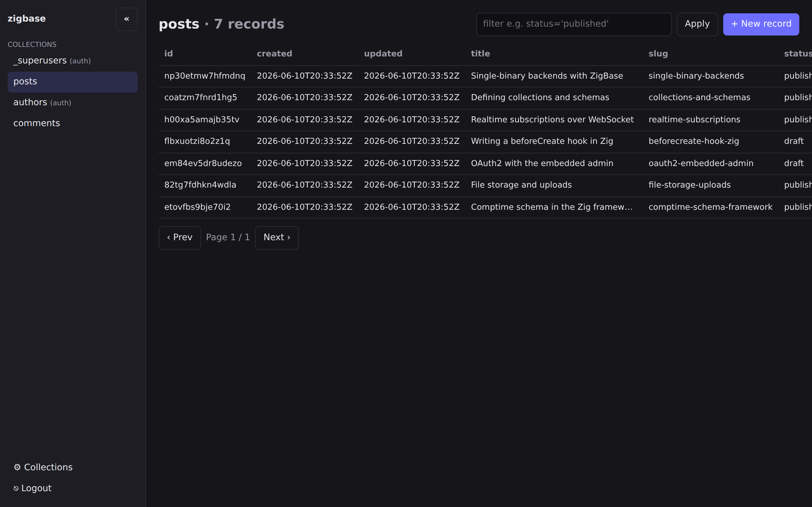

# Overview

**ZigBase is a backend and an embeddable Zig framework for building beyond your team
size.** It combines application services with control over custom logic, resource use,
and deployment. Start on embedded SQLite, extend the server in Zig, and use the opt-in
PostgreSQL backend when your workload calls for it.

Write your application directly or work with a coding agent. Both use the same public
APIs, examples, and local tests; no AI service is required. Read
[Why ZigBase](./why-zigbase) for the design choices, evidence, and scaling boundaries.

## Choose how to build

1. **Build with the framework.** Configure `zigbase.App(.{...})` with typed hooks,
   routes, jobs, schema, migrations, and plugins. Your application includes the backend
   and its extensions in one executable. Start with the [tutorial](./tutorial) or
   [framework reference](./framework).
2. **Run the stock backend.** Use its collections, REST API, clients, realtime, and
   admin UI without writing Zig. Start with the [quick start](./quick-start).
3. **Work with a coding agent.** Use generated project instructions and the same
   framework or stock backend, with structured CLI feedback and local verification.
   Start with the [agent orientation](./agents).

Pair either mode with [Zigapagos](./zigapagos-pairing) for a frontend served from the
same origin, or bring your preferred frontend. ZigBase is PocketBase-inspired but is
not API-compatible.

## Features

- **Collections & schema** — define collections with typed fields; explicit offline
  collection renames preserve database identities and file prefixes without copying
  local or remote objects; schema migrations run
  on startup.
- **Records & query API** — typed CRUD with `filter`, `sort`, and `expand` on relations.
  → [API](./api)
- **Access rules** — per-collection list / view / create / update / delete rules;
  blank = locked, `"@public"` = open.
  → [API](./api#access-rules)
- **Auth** — argon2id password, magic-link, OTP, and WebAuthn passkey auth. JWT tokens,
  verification, and password-reset flows. → [API](./api#auth)
- **OAuth2** — Authorization-Code + PKCE provider login and account linking.
  → [API](./api#oauth2)
- **Two-factor authentication** — TOTP, WebAuthn, and recovery codes with collection,
  user, and application-owned group policies; select factors and policy hooks at
  compile time. → [Framework](./framework#two-factor-authentication)
- **Session management** — token-epoch revocation (`revokeAllSessions`), optional
  per-device session table (`listActiveSessions` / `revoke`), and auth lifecycle hooks
  (`beforeAuthSuccess`, `beforeRegister`). → [Framework](./framework)
- **Rate limiting** — global rate limiter plus per-auth-method limits; set each method's
  `.rate_limit` option at comptime, or call `ac.rateLimit()` from a custom auth method at
  runtime.
- **Field encryption** — mark any text/JSON field `encrypted` for AES-256-GCM at rest;
  rotate keys live with `zigbase rewrap`. → [Framework](./framework)
- **TTL / expiry** — declare `.ttl_field` on a collection and the framework GC's expired
  rows automatically every 5 minutes. → [Framework](./framework)
- **KV store & feature flags** — built-in key-value store (`ctx.kv` / `ctx.flag`)
  accessible from hooks and routes; managed in the admin Settings UI.
  → [Framework](./framework)
- **Ctx capability layer** — a single `*Ctx` passed to every hook, route, and job wraps
  records, auth, KV, flags, outbound HTTP, and atomic transactions; connection pooling
  is handled for you. → [Framework](./framework)
- **Realtime** — subscribe to record changes over WebSocket + SSE, broadcast on custom channels
  from routes and jobs; record-change delivery fans out across app instances on Postgres.
  → [Realtime broadcast](./realtime-broadcast)
- **PostgreSQL backend (opt-in)** — build with `-Dpostgres` and point `ZIGBASE_DB_URL` at a
  `postgres://` URL; `zigbase migrate-db` moves an existing SQLite instance across.
  → [PostgreSQL](./postgres)
- **Multi-tenancy** — account-scoped collections with built-in accounts, memberships,
  invitations, and roles; fail-closed. → [Multi-tenancy](./tenancy)
- **Relationship abilities** — authorize by the caller's relationship to the row,
  comptime-validated and fail-closed. → [Abilities](./abilities)
- **Full-text & vector search** — ranked `?search=` queries on `.searchable` fields;
  opt-in `-Dvector` KNN. → [Search](./search)
- **Product analytics** — immutable `ctx.track` events, declarative rollups, and a
  tenant-scoped read API. → [Analytics](./analytics)
- **Background jobs & queues** — durable or in-memory queues with priorities and retries;
  `ctx.enqueue` from anywhere. → [Jobs & webhooks](./jobs-and-webhooks)
- **Outbound webhooks** — signed, idempotent deliveries with retries and capped backoff.
  → [Jobs & webhooks](./jobs-and-webhooks)
- **CAPTCHA** — `ctx.verifyCaptcha` for reCAPTCHA, hCaptcha, and Turnstile.
  → [Recipes](./recipes#recipe-gate-a-public-form-with-captcha)
- **Files** — local (pluggable) file storage with serving and short-lived file-access
  tokens. Optional [image thumbnails](./thumbnails) use compile-time named
  PNG/JPEG/WebP profiles and a trusted external ImageMagick executable, with
  tunable process limits and bounded admission. Disabled builds exclude the
  subprocess backend; no image codec is linked into ZigBase. Sources are local,
  not remote storage.
  Opt-in durable HTTP cleanup retries removed-file deletion after commit,
  using the existing queue engine. Opt-in [resumable uploads](./resumable-uploads)
  resume interrupted transfers with bounded buffers and fresh authorization at
  commit. Optional SQLite/local persistence survives process restarts with a
  single owner; neither mode is streaming or cross-instance resume.
  Optional [offline reconciliation](./framework#offline-orphan-reconciliation-opt-in-cli)
  previews and explicitly removes unreferenced local/SQLite files in bounded
  maintenance batches; it refuses active cooperating apps, not arbitrary external writers.
  → [API](./api#files), [Framework](./framework#durable-http-file-cleanup-opt-in)
- **Admin UI** — embedded single-page app served at `/_/`, including a Settings screen
  for managing KV/feature flags.
- **Framework** — comptime record hooks, custom routes, scheduled jobs, a comptime schema
  (with additive auto-migration), and pluggable storage/mailer backends. → [Framework](./framework)
- **Persistent REST retry receipts** — explicitly keyed, authenticated JSON record
  create/update/delete can commit their receipt with the SQLite/PostgreSQL mutation.
  Bound retention and capacity, recheck current authorization on replay, and reject
  unsupported hook/file/auth collection workflows. → [REST record idempotency](./framework#rest-record-idempotency)
- **Retry-safe custom DB operations** — opt-in SQLite/PostgreSQL idempotency receipts bind
  retry keys to authenticated principals, operations and payloads; replay still
  checks current access. Comptime capacity, retention and result limits keep the
  helper bounded, and unused apps pay no runtime cost. This does not promise
  exactly-once external effects. PostgreSQL replicas coordinate using fail-fast
  namespace transaction locks. → [Idempotent mutations](./framework#idempotent-custom-mutations-opt-in-sqlitepostgresql)
- **Email** — transactional mail with multipart HTML+text templates, SES / Postmark / SMTP
  providers, verified per-account senders, and bounce suppression. → [Email](./email)
- **Deterministic testing** — freeze time (`ZIGBASE_FAKE_NOW`), fix randomness
  (`ZIGBASE_FAKE_SEED`), and capture outbound mail in test suites — all gated off in
  production builds.
- **Route and query diagnostics** — opt-in bounded method/template duration aggregates,
  SQLite/PostgreSQL query measurements, HTTP outcome counts, pool mutex waits, and
  declared durable/scheduled job attempts. Operator-only inspection includes SQL-free
  handlers; synchronous dispatch duration is not end-to-end request latency.
  → [Query workbench](./framework#bounded-query-workbench-opt-in)
- **Performance contracts** — opt-in binary-size and allocation budgets with
  versioned CI reports; timing comparisons stay advisory. → [Testing](./testing#performance-contracts)

## An admin UI for direct operation

Inspect records, manage collections, and configure access rules in the embedded admin
UI at `/_/`. The dashboard complements code and CLI workflows; no agent is needed to
explore or operate the backend.

## When to use ZigBase

Choose ZigBase when you want integrated backend capabilities and the ability to extend
them in compiled Zig, with inspectable resource settings and control over deployment.
The framework supports both small initial deployments and deliberate growth through
measurement, tuning, and an opt-in PostgreSQL backend.

Run one SQLite writer process. Before adding application replicas, review database
migration, shared file storage, and job coordination in the [deployment guide](./deployment).
Compile-time schema auto-migration is additive-only; other changes need explicit migrations.
Cron and interval jobs are per-process by default, with opt-in distributed coordination.

ZigBase is an early release under Apache-2.0. Read the
[known limitations](./known-limitations) and [engineering backlog](./roadmap) for current
boundaries and planned work. Explicit resource controls are tools for performance
engineering, not a promise of a fixed memory footprint or universal scale.

## Where to go next

- **[Quick start](./quick-start)** — install, create a superuser, serve, hit the API.
- **[Tutorial](./tutorial)** — build a backend end to end (provision → rules → signup →
  records + file upload → custom route → cron).
- **[PostgreSQL](./postgres)** — take the same app to Postgres when you outgrow one box.
- **[Framework](./framework)** — the full hook / route / job / schema / plugin surface.
- **[API](./api)** — the REST + WebSocket reference.
## Agent-friendly discovery

`zigbase capabilities --json` provides a versioned catalog of development CLI
operations, their output formats, and their side effects. Discovery works offline
without opening the database. Custom lean builds can omit it with
`-Ddev-tools=false`. See the agent guide for the contract and inspection caveats.

The catalog separates required-input descriptors from runnable arguments,
so an agent can discover the tuning advisor's input contract. `zigbase diagnostics`
wraps doctor checks in versioned JSON with structured failures; it retains doctor's
deployment probes and possible database writes, not an offline safety guarantee.

`zigbase migrate preview --json` inventories compiled consumer migration declarations
without opening a database or running callbacks. Agents can inspect transaction and
reverse-callback declarations while pending state, SQL, effects and runtime reversibility
remain explicitly unknown. This is not an execution plan or safe-rollback guarantee.
Like route discovery, it is compiled out with `-Ddev-tools=false`.

Contributors in the ZigBase checkout can also use `tools/agent_tests.py` for
static JSON test inventory and focused pytest or TypeScript/Python SDK unit-suite execution with time and combined
output limits. It runs only advertised module/function/suite selectors and reports
structured process outcomes. Its selection-only `affected --base <commit>` command uses bounded
Git inspection and explicit dependency rules to suggest module checks after edits;
unmapped paths fall back to the whole allowlist with explicit coverage gaps. It
does not infer complete test coverage or replace CI. The allowlist includes local performance-contract, parity-replay
and agent-tool checks that need no Zig build or browser; local Git/subprocess and
loopback fixtures still require their advertised development permissions. The SDK
unit selectors use pinned runtimes and already-installed dependencies: TypeScript
uses at most two workers; Python runs serially with explicit async-test support
and this checkout's SDK source. Neither installs packages or replaces SDK
integration/typecheck/build checks. This is not an embedded
app executor or a sandbox; it adds no code to deployed binaries. See the
[agent guide](../../../docs/agents.md#focused-repository-tests) for setup and coverage limits.
