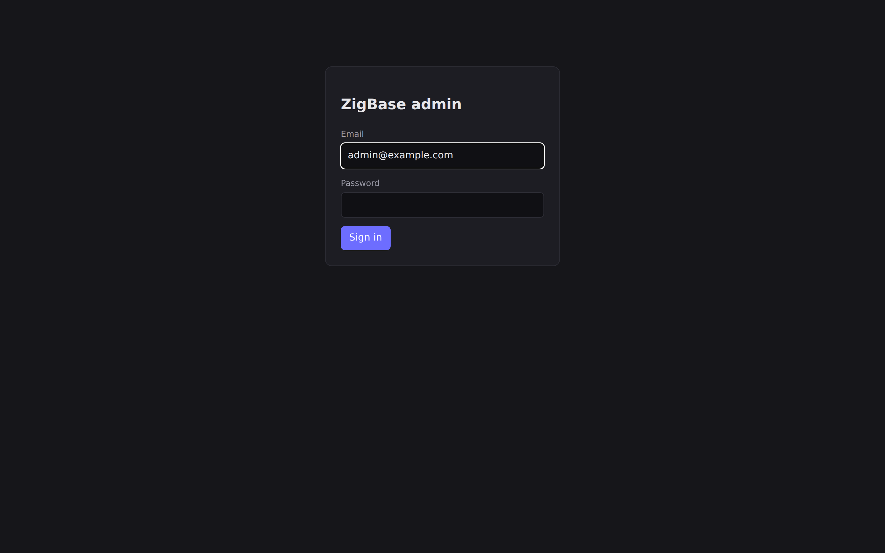

# Quick start

Get a ZigBase server running in a few minutes — either from a prebuilt binary or by
building from source.

## Build from source

You need **Zig 0.16.0** (pinned in `mise.toml`). Either activate mise
(`eval "$(mise activate bash)"`) or prefix the build with `mise exec zig@0.16.0 --`.

```sh
mise install                                    # installs Zig 0.16.0 (pinned in mise.toml)
zig build                                        # -> zig-out/bin/zigbase
# or: mise exec zig@0.16.0 -- zig build
```

## Download a binary

Prebuilt binaries for Linux (`x86_64`/`aarch64`, musl) and macOS are published with each
release. Download the asset for your target, extract it, and you have the `zigbase`
executable — no toolchain required. See the [Download page](../download) for the asset
table and checksums.

## Create a superuser

Collection management is **superuser-only**, so create one before serving:

```sh
./zig-out/bin/zigbase superuser create \
  --email you@example.com \
  --password "<a strong password>" \
  --data-dir ./zb_data
```

## Set a JWT secret and serve

Set a strong, random `ZIGBASE_JWT_SECRET` (the server warns, or refuses to start behind
HTTPS, when the secret is left at its insecure default), then start serving:

```sh
ZIGBASE_JWT_SECRET="$(head -c 32 /dev/urandom | base64)" \
  ./zig-out/bin/zigbase serve --data-dir ./zb_data
```

The default bind is `0.0.0.0:8090`.

> Configure the bind host/port, data directory, token lifetimes, SMTP, rate limiting, and
> more via environment variables or `serve` flags. The full table is in
> [Configuration](./configuration).

## Verify it's up

```sh
curl http://127.0.0.1:8090/api/health           # {"status":"ok"}
```

## Open the admin UI

Open **http://127.0.0.1:8090/_/** in a browser and sign in as the superuser you created.
The embedded admin SPA lets you manage collections, edit records, view the schema, watch a
realtime live-view, and configure OAuth2.



Everything the admin UI does is also a REST call away — the [Tutorial](./tutorial) shows
every step both ways, from the admin UI and from the terminal.

## Next steps

- **[Tutorial](./tutorial)** — provision collections, set access rules, register a user,
  upload a file, add a custom route and a cron job.
- **[API](./api)** — the REST + WebSocket reference.
- **[Framework](./framework)** — extend the server in Zig.
