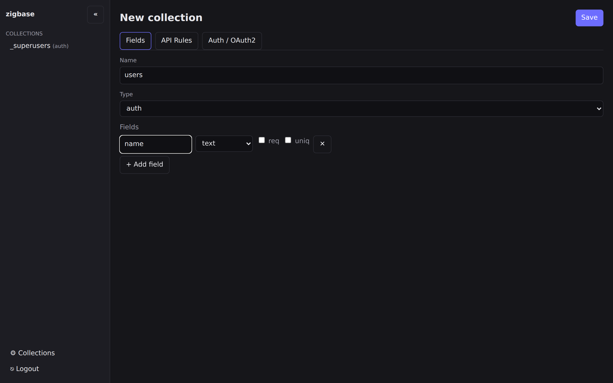
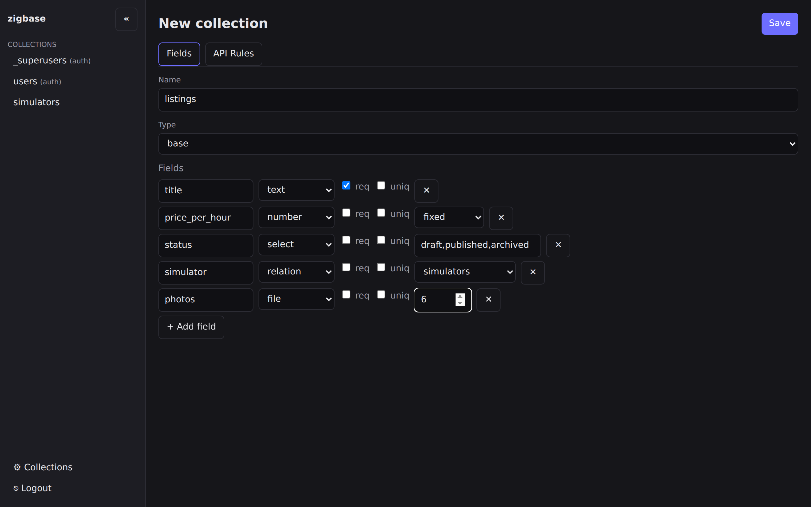
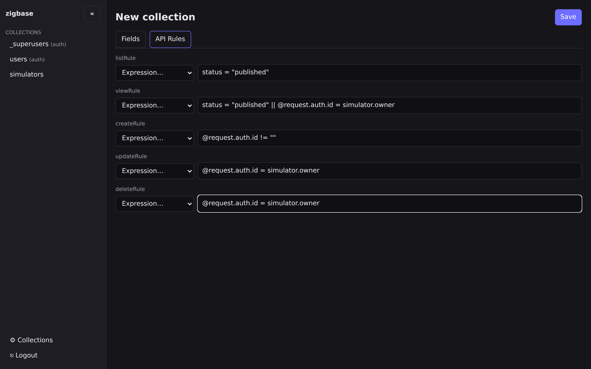
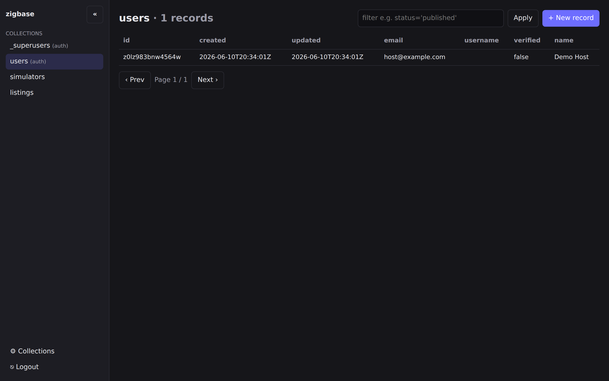
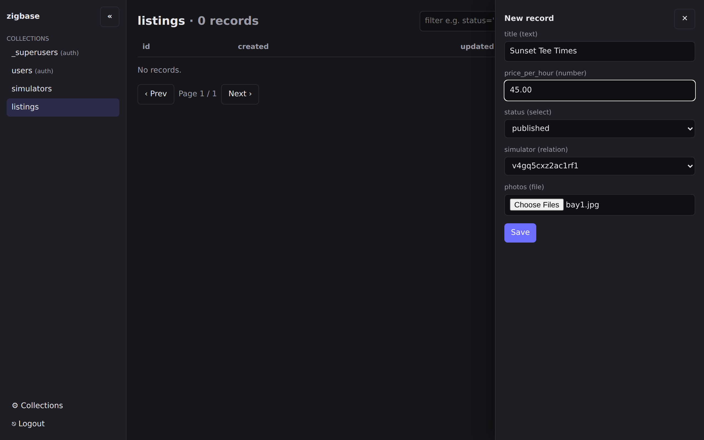
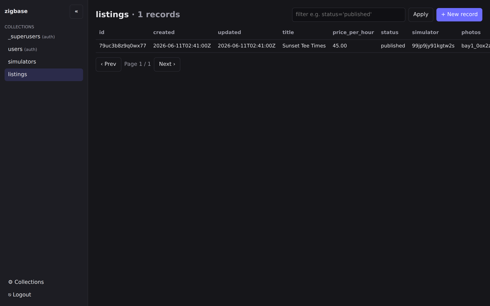
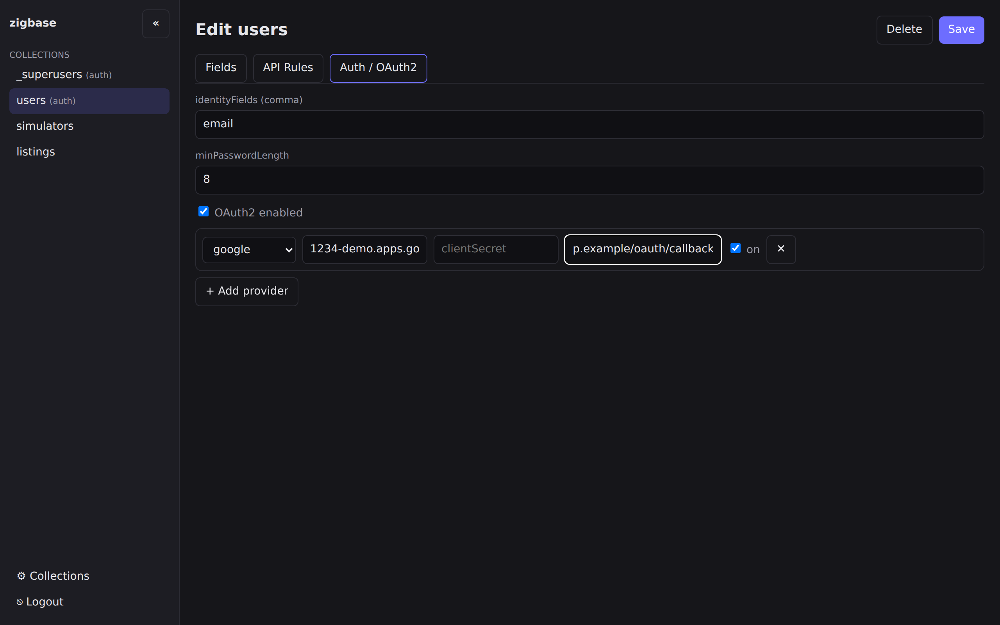
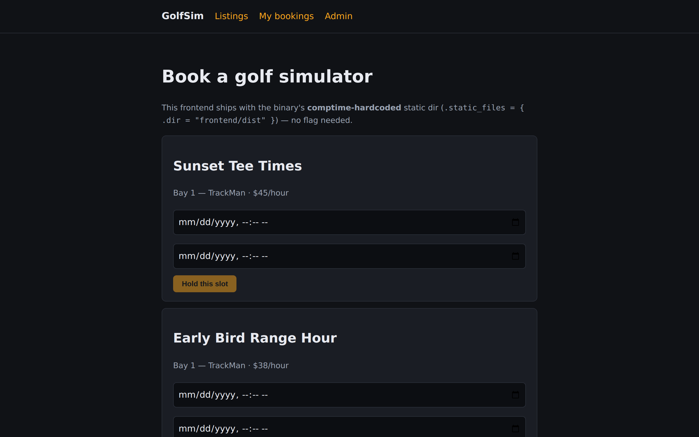

import PathTabs from '../../components/PathTabs.astro';

# Tutorial: build an app on ZigBase

This walkthrough takes you from an empty database to a working backend for **"Airbnb for
golf simulators"** — hosts list simulators, guests book slots. It ties together every
moving part: provisioning collections, setting access rules, registering and logging in a
user, creating a record with a file upload, a custom business route, and a scheduled job.

Every step that talks to the server can be done two ways — from the **embedded admin UI**
at `/_/` or from the **terminal** with `curl` — and the tab switcher on any step flips the
whole page at once, so pick your path and the tutorial follows you.

Read it top to bottom and run it as you go. Each step links onward to the reference docs:

- field types & option shapes → [Fields](./fields)
- the full curl recipes this tutorial condenses → [Recipes](./recipes)
- endpoint envelopes, rule semantics, realtime, files → [API](./api)
- hooks, custom routes, jobs (the Zig framework) → [Framework](./framework)

## 0. Run the server

Build the binary and create a superuser (collection management is superuser-only), then
start serving:

```sh
mise install                                     # Zig 0.16.0, pinned in mise.toml
zig build                                         # -> zig-out/bin/zigbase
./zig-out/bin/zigbase superuser create --email admin@example.com --password "a-strong-password" --data-dir ./zb_data
ZIGBASE_JWT_SECRET="$(head -c 32 /dev/urandom | base64)" ./zig-out/bin/zigbase serve --data-dir ./zb_data
```

The server listens on `http://127.0.0.1:8090`. Sanity check:

```sh
curl http://127.0.0.1:8090/api/health   # {"status":"ok"}
```

Throughout, `BASE=http://127.0.0.1:8090`.

### Open the admin UI

The same binary embeds an admin SPA at **http://127.0.0.1:8090/_/**. Open it and sign in
with the superuser you just created — every admin-UI step below starts from here.


## 1. Provision collections (in dependency order)

The schema is three collections — `users` (auth), `simulators`, and `listings` — created
in that order, because relation fields point at collections that must already exist.

<PathTabs>
  <Fragment slot="ui">

In the admin UI's left sidebar, click **⚙ Collections**, then **+ New collection** to open
the schema editor. Create the three collections in order:

1. **`users`** — set the name to `users` and the type to **auth**. Click **+ Add field**
   and add one extra field: `name`, type **text**. (Auth collections get `email`,
   `verified`, and the password machinery for free.)

   

   Before saving, switch to the **API Rules** tab. A new collection starts with every rule
   **locked** — the `lock` checkbox means *superuser-only* (`null`). Unchecking it enables
   the text input: leave it **empty** for *public* (`""`), or type a filter expression.
   For `users`: uncheck the lock on **listRule**, **viewRule**, and **createRule** and
   leave all three empty (public — an empty `createRule` is what makes signup open), and
   uncheck **updateRule** and **deleteRule** and type `@request.auth.id = id` into both
   (users may only edit or delete themselves). Save.

2. **`simulators`** — type **base**, two fields: `label` (**text**, check *req*) and
   `owner` (**relation**, check *req*) — pick `users` from the relation's target dropdown.
   Note the convenience here: the UI picks relation targets **by name** and the server
   resolves the id for you; on the terminal path you have to capture and substitute
   collection ids yourself. Rules: unlock **listRule** and **viewRule** as empty (public),
   set **createRule** to `@request.auth.id != ""`, and set **updateRule** and
   **deleteRule** to `@request.auth.id = owner`. Save.

3. **`listings`** — type **base**, five fields: `title` (**text**, *req*),
   `price_per_hour` (**number**, *req* — leave the mode dropdown on **float**), `status`
   (**select**, *req* — type `draft,published,archived` into the values input), `simulator`
   (**relation**, *req* — target `simulators`), and `photos` (**file** — set *maxSel* to
   `6`).

   

   Rules: unlock all five; **listRule** `status = "published"`, **viewRule**
   `status = "published" || @request.auth.id = simulator.owner`, **createRule**
   `@request.auth.id != ""`, and **updateRule** / **deleteRule**
   `@request.auth.id = simulator.owner`. Save.

> **What the UI can't set (yet):** advanced field options are API-only today —
> `cascadeDelete` / `minSelect` on relations, `min` / `max` / `pattern` on text,
> `min` / `max` / `scale` on number, and `maxSize` / `mimeTypes` on file. The schema the
> UI saves is the same shape as the terminal path's payloads, minus those constraints.

  </Fragment>
  <Fragment slot="cli">

There is no schema-file import — you create collections by calling `POST /api/collections`
as the superuser. Relation fields point at their target by **collection id** (the `id`
from the create response, **not** the name — see
[the relation gotcha](./fields#relation)), so you must create targets first and **capture
each returned id**.

First, log in as the superuser. Superusers live in the built-in `_superusers` auth
collection, so they use the normal auth endpoint:

```sh
TOKEN=$(curl -s -X POST "$BASE/api/collections/_superusers/auth-with-password" \
  -H 'Content-Type: application/json' \
  -d '{"identity":"admin@example.com","password":"a-strong-password"}' | jq -r .token)
```

Create `users` (auth) and capture its id:

```sh
USERS_ID=$(curl -s -X POST "$BASE/api/collections" \
  -H "Authorization: Bearer $TOKEN" -H 'Content-Type: application/json' \
  -d '{
    "name": "users",
    "type": "auth",
    "fields": [ { "id": "f_name", "name": "name", "type": "text", "options": { "max": 100 } } ],
    "listRule": "", "viewRule": "",
    "createRule": "",
    "updateRule": "@request.auth.id = id",
    "deleteRule": "@request.auth.id = id"
  }' | jq -r .id)
```

Then `simulators` (references `users` by id), then `listings` (references `simulators`).
The full four-collection script — including `bookings` — is in
[Recipes → Provisioning your schema](./recipes#recipe-provisioning-your-schema). Here is
`listings`, which also carries a `file` field for photos:

```sh
SIMS_ID=$(curl -s -X POST "$BASE/api/collections" \
  -H "Authorization: Bearer $TOKEN" -H 'Content-Type: application/json' \
  -d "{
    \"name\": \"simulators\", \"type\": \"base\",
    \"fields\": [
      { \"id\": \"f_label\", \"name\": \"label\", \"type\": \"text\", \"required\": true, \"options\": { \"min\": 1 } },
      { \"id\": \"f_owner\", \"name\": \"owner\", \"type\": \"relation\", \"required\": true,
        \"options\": { \"targetCollectionId\": \"$USERS_ID\", \"cascadeDelete\": true, \"maxSelect\": 1 } }
    ],
    \"listRule\": \"\", \"viewRule\": \"\",
    \"createRule\": \"@request.auth.id != \\\"\\\"\",
    \"updateRule\": \"@request.auth.id = owner\",
    \"deleteRule\": \"@request.auth.id = owner\"
  }" | jq -r .id)

LISTINGS_ID=$(curl -s -X POST "$BASE/api/collections" \
  -H "Authorization: Bearer $TOKEN" -H 'Content-Type: application/json' \
  -d "{
    \"name\": \"listings\", \"type\": \"base\",
    \"fields\": [
      { \"id\": \"f_title\", \"name\": \"title\", \"type\": \"text\", \"required\": true, \"options\": { \"min\": 1, \"max\": 140 } },
      { \"id\": \"f_price\", \"name\": \"price_per_hour\", \"type\": \"number\", \"required\": true,
        \"options\": { \"mode\": \"float\" } },
      { \"id\": \"f_status\", \"name\": \"status\", \"type\": \"select\", \"required\": true,
        \"options\": { \"values\": [\"draft\", \"published\", \"archived\"], \"maxSelect\": 1 } },
      { \"id\": \"f_sim\", \"name\": \"simulator\", \"type\": \"relation\", \"required\": true,
        \"options\": { \"targetCollectionId\": \"$SIMS_ID\", \"cascadeDelete\": true, \"maxSelect\": 1 } },
      { \"id\": \"f_photos\", \"name\": \"photos\", \"type\": \"file\",
        \"options\": { \"maxSelect\": 6, \"maxSize\": 5242880, \"mimeTypes\": [\"image/png\", \"image/jpeg\"] } }
    ],
    \"listRule\": \"status = \\\"published\\\"\",
    \"viewRule\": \"status = \\\"published\\\" || @request.auth.id = simulator.owner\",
    \"createRule\": \"@request.auth.id != \\\"\\\"\",
    \"updateRule\": \"@request.auth.id = simulator.owner\",
    \"deleteRule\": \"@request.auth.id = simulator.owner\"
  }" | jq -r .id)
```

The field shapes used here are catalogued in [Fields](./fields).

  </Fragment>
</PathTabs>

> **Money fields:** `price_per_hour` uses the default **float** number mode here. A
> fixed-point **fixed** mode (exact decimal strings like `"45.00"`, no float drift) exists
> for money — see [Fields → number](./fields#number) — but it is currently API-only (it
> requires a `scale` option the admin UI doesn't expose yet) and has a known limitation
> with multipart file-upload requests. See [Known limitations](./known-limitations).

## 2. Understand the access rules you just set

Each collection's five rules (`listRule`/`viewRule`/`createRule`/`updateRule`/
`deleteRule`) are filter expressions; `""` means public, `null` means superuser-only,
anything else is checked per request. Highlights from above:

- `users`: `createRule: ""` → **open signup** (anyone may create a user). Update/delete
  are self-only (`@request.auth.id = id`).
- `simulators`/`listings`: writes are **owner-scoped** (`@request.auth.id =
  simulator.owner`), which uses **relation traversal** — following the single-value
  `simulator` relation to read the owner.
- `listings` are publicly listable only when `status = "published"`; the owner can also
  view their drafts.

<PathTabs>
  <Fragment slot="ui">

This is the **API Rules** tab of `listings` as you left it — the `lock` checkbox is the
`null` (superuser-only) state, an unlocked empty input is public, and anything you type is
evaluated per request:



  </Fragment>
  <Fragment slot="cli">

On the terminal path there is nothing left to do here: the rules were the
`listRule` … `deleteRule` keys you already sent in step 1's `POST /api/collections`
payloads, and they took effect the moment each collection was created.

  </Fragment>
</PathTabs>

Rule grammar and denial status codes are in [API → Access rules](./api#access-rules);
owner-scoped and relation-traversal patterns (and how the `owner` field gets set safely)
are in [Recipes → Owner-scoped access rules](./recipes#recipe-owner-scoped-access-rules).

## 3. Register a user and log in

Signup is a **record create on the `users` auth collection** (there is no separate
register endpoint). The server hashes the password, strips the plaintext, sets
`verified=false`, and mints a token key.

<PathTabs>
  <Fragment slot="ui">

Signup is deliberately an **end-user action**, even on the admin-UI path: the admin record
drawer has no password field, because users register themselves through your app (or, here,
through two curls):

```sh
curl -s -X POST "$BASE/api/collections/users/records" \
  -H 'Content-Type: application/json' \
  -d '{"email":"host@example.com","password":"hostpassword","name":"Demo Host"}'
```

`password` must be at least `minPasswordLength` (default 8). Log in to get the token and
id the terminal path uses for step 4 (the admin-UI path won't need them):

```sh
LOGIN=$(curl -s -X POST "$BASE/api/collections/users/auth-with-password" \
  -H 'Content-Type: application/json' \
  -d '{"identity":"host@example.com","password":"hostpassword"}')
HOST_TOKEN=$(echo "$LOGIN" | jq -r .token)
HOST_ID=$(echo "$LOGIN"   | jq -r .record.id)
```

Now click **users** in the admin sidebar — the new record is there:



And if you already had the table open when the curl ran, the row appeared **without a
refresh**: the records table is a live realtime subscriber over WebSocket, so you're
literally watching the realtime API at work. Click the row to open the record drawer —
you can edit the user from here (for example, tick `verified`).

  </Fragment>
  <Fragment slot="cli">

```sh
curl -s -X POST "$BASE/api/collections/users/records" \
  -H 'Content-Type: application/json' \
  -d '{"email":"host@example.com","password":"hostpassword","name":"Demo Host"}'
```

`password` must be at least `minPasswordLength` (default 8). Now log in to get a token and
the user's id:

```sh
LOGIN=$(curl -s -X POST "$BASE/api/collections/users/auth-with-password" \
  -H 'Content-Type: application/json' \
  -d '{"identity":"host@example.com","password":"hostpassword"}')
HOST_TOKEN=$(echo "$LOGIN" | jq -r .token)
HOST_ID=$(echo "$LOGIN"   | jq -r .record.id)
```

  </Fragment>
</PathTabs>

Details: [Recipes → User registration](./recipes#recipe-user-registration-signup) and
[API → Auth](./api#auth).

## 4. Create records, including a file upload

Time for data: a simulator the host owns, then a listing with a photo.

<PathTabs>
  <Fragment slot="ui">

Click **simulators** in the sidebar, then **+ New record**. The drawer renders one control
per field: type `Bay 1 — TrackMan` into `label`, and pick the host's record from the
`owner` relation dropdown (it lists `users` records by id). Save.

Then open **listings** → **+ New record**: `title` `Sunset Tee Times`, `price_per_hour`
`45.00`, `status` `published` from the select dropdown, the simulator you just created
from the `simulator` relation dropdown, and choose a photo (say, `bay1.jpg`) in the
`photos` file input — it accepts multiple files since `maxSelect` is 6.



Save. The drawer sends plain JSON normally, and switches to a `multipart/form-data` upload
automatically when files are chosen — the same two request shapes the terminal path makes
by hand. The listings table now shows the record, uploaded filename included (and on
edit, existing files get "(remove)" checkboxes):



  </Fragment>
  <Fragment slot="cli">

Create a simulator the host owns:

```sh
SIM_ID=$(curl -s -X POST "$BASE/api/collections/simulators/records" \
  -H "Authorization: Bearer $HOST_TOKEN" -H 'Content-Type: application/json' \
  -d "{\"label\":\"Bay 1 — TrackMan\",\"owner\":\"$HOST_ID\"}" | jq -r .id)
```

Now create a listing **with a photo upload**. A `file` field is populated via
`multipart/form-data`: send the non-file fields as form fields and the file under the
field's name (`photos`). With `curl`, use `-F`:

```sh
curl -s -X POST "$BASE/api/collections/listings/records" \
  -H "Authorization: Bearer $HOST_TOKEN" \
  -F "title=Sunset Tee Times" \
  -F "price_per_hour=45.00" \
  -F "status=published" \
  -F "simulator=$SIM_ID" \
  -F "photos=@./bay1.jpg;type=image/jpeg"
```

  </Fragment>
</PathTabs>

The uploaded file is stored locally and served from
`GET /api/files/listings/:recordId/:filename`. Because `listings` has a public `viewRule`
for published rows, the photo serves directly; protected collections need a bearer token,
the auth cookie, or a short-lived **file token**. See [API → Files](./api#files).

## 5. Configure OAuth2 sign-in (optional)

Password signup works, but "Sign in with Google" is a form away: open the **users**
collection in the schema editor and switch to its **Auth / OAuth2** tab. It holds the
auth-collection knobs (`identityFields`, `minPasswordLength`) plus an **OAuth2 enabled**
checkbox and a **+ Add provider** picker (google, github, microsoft, discord, or generic).
Add a provider, paste the client id and the write-only client secret from the provider's
console, and list the redirect URL(s) your app uses — what would otherwise be an afternoon
of OAuth plumbing is a form:



Your frontend then lists enabled providers and exchanges the authorization code via two
endpoints — see [API → OAuth2](./api#oauth2) for the flow.

## 6. Add a custom business route (the Zig framework)

REST CRUD covers most needs, but "confirm a booking" is business logic. ZigBase is an
**embeddable Zig framework**: import it, register a custom route, and your binary *is* the
server. A `POST /api/bookings/:id/confirm` handler reads the `:id` path param, loads the
record, and flips its status:

```zig
const std = @import("std");
const zigbase = @import("zigbase");

fn confirmBooking(ev: *zigbase.RouteEvent) anyerror!zigbase.http.Response {
    const a = ev.ctx.allocator;
    const id = ev.ctx.param("id") orelse
        return .{ .status = 404, .body = "{\"code\":404,\"message\":\"Not found.\",\"data\":{}}" };

    const w = ev.app.pool.acquireWriter();
    defer ev.app.pool.releaseWriter();
    const data = zigbase.Data{ .app = ev.app, .conn = w, .io = ev.app.io };

    var patch: std.json.ObjectMap = .empty;
    try patch.put(a, "status", .{ .string = "confirmed" });
    const updated = (try data.update("bookings", id, .{ .object = patch })) orelse
        return .{ .status = 404, .body = "{\"code\":404,\"message\":\"Not found.\",\"data\":{}}" };

    return .{ .status = 200, .body = try std.json.Stringify.valueAlloc(a, updated, .{}) };
}
```

`RouteEvent` gives you `app`, `ctx` (path params via `ctx.param`), and `rctx` (auth
identity for finer authorization). It does **not** carry a `Data` facade, so you build one
from the pool. The full version (with owner authorization) is in
[Recipes → a custom business route](./recipes#recipe-a-custom-business-route-with-a-path-param--db-write).

## 7. Add a scheduled job

A nightly job cancels stale pending bookings. A `JobEvent` carries only `app` and `name`,
so — like the route above — you acquire a connection and build `Data`:

```zig
fn expireStaleBookings(ev: *zigbase.events.JobEvent) anyerror!void {
    const a = ev.app.allocator;
    const w = ev.app.pool.acquireWriter();
    defer ev.app.pool.releaseWriter();
    const data = zigbase.Data{ .app = ev.app, .conn = w, .io = ev.app.io };

    const stale = try data.list("bookings", .{ .filter = "status = \"pending\"", .perPage = 200 });
    for (stale.items) |item| {
        const bid = item.object.get("id").?.string;
        var patch: std.json.ObjectMap = .empty;
        try patch.put(a, "status", .{ .string = "cancelled" });
        _ = try data.update("bookings", bid, .{ .object = patch });
    }
}
```

## 8. Wire it all into your `App(.{...})`

The hook, route, and job come together in one comptime config. This is the whole extended
server:

```zig
const std = @import("std");
const zigbase = @import("zigbase");

// ... confirmBooking, expireStaleBookings, validateBooking defined above ...

pub fn main(init: std.process.Init) !void {
    return zigbase.App(.{
        .hooks = .{
            .bookings = .{ .beforeCreate = validateBooking }, // overlap check + computed field
        },
        .routes = .{
            .{ .method = .POST, .path = "/api/bookings/:id/confirm", .handler = confirmBooking, .auth = .authed },
        },
        .jobs = .{ .pool_size = 2 },
        .cron = .{
            .{ .name = "expire-bookings",
               .schedule = zigbase.schedule.Schedule{ .cron = "0 3 * * *" },
               .handler = expireStaleBookings },
        },
    }).runCli(init);
}
```

`runCli` gives your binary the same `serve` / `migrate` / `superuser create` / `help`
commands as the stock server. A misconfigured extension (unknown config key, typo'd hook
phase, wrong-typed handler) is a **compile error**, so it never reaches runtime.

Build and run your binary exactly as in step 0 (it replaces `zig-out/bin/zigbase`). The
`validateBooking` before-hook is shown in full in
[Recipes → computed-field / validation hook](./recipes#recipe-a-computed-field--validation-beforecreate-hook).

## Where to go next

- **Field reference:** every type and option → [Fields](./fields)
- **More recipes:** provisioning, owner rules, hooks, routes, jobs → [Recipes](./recipes)
- **API reference:** records query (`filter`/`sort`/`expand`), realtime, files → [API](./api)
- **Framework reference:** the full hook/route/job/event surface → [Framework](./framework)
- **Caveats:** [Known limitations](./known-limitations)

## The finished app

This exact backend — same collections, same rules, plus the booking hook, route, and cron
job — ships as a runnable example with a web frontend baked into the binary:



Browse the walkthrough at [Examples → Golf simulator booking](../examples/golfsim), or see
the other rungs of the ladder (a minimal blog, a plugin marketplace) on the
[Examples](../examples) index.
